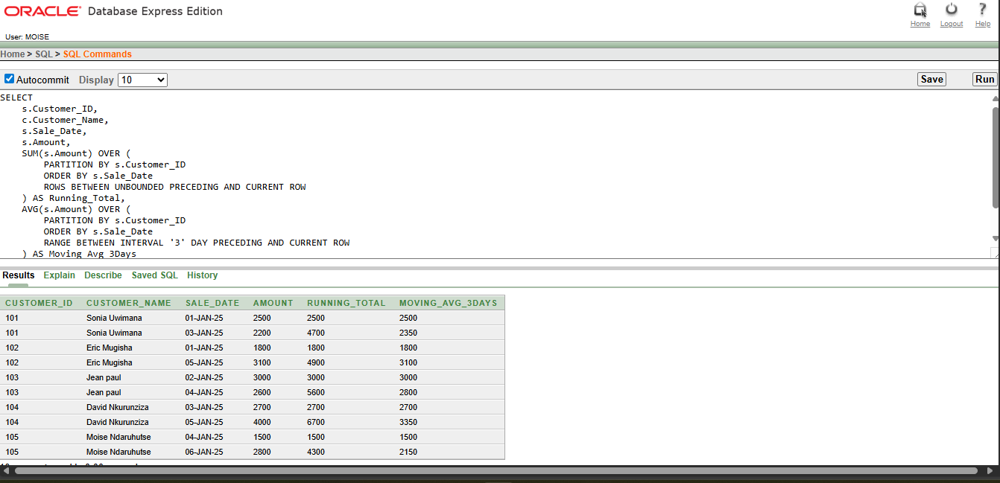
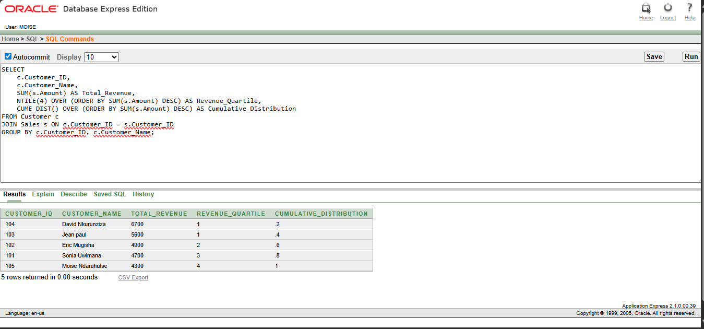

# plsql-window-functions-MVUYEKURE-Laurien

## Student: MVUYEKURE Laurien
## ID: 28319
## DEPARTMENT: SOFTWARE Engineering
## Course:  Database Development with PL/SQL (INSY 8311)
## Instructor: Eric Maniraguha
## Date: 01/10/2025

# Project Topic : PL/SQL Window Functions Mastery Project

1. Problem Definition
1.1 Business Context

A retail company tracks customer purchases in a relational database. Management wants deeper insights into top customers, sales performance trends, period-to-period growth, and customer segmentation. Standard SQL aggregates are not enough — we need window functions for advanced analytics.

1.2 Data Challenge

Identify top N customers by revenue.
Compute running totals, averages, and trends using frame clauses.
Compare sales period-to-period to measure growth.
Segment customers into groups (quartiles, cumulative distribution).

1.3 Expected Outcome

SQL scripts using ROW_NUMBER, RANK, DENSE_RANK, PERCENT_RANK, SUM, AVG, MIN, MAX, LAG, LEAD, NTILE, CUME_DIST.

Clear insights: who buys most, how sales evolve, growth rates, and customer segmentation.

GitHub repository with scripts, screenshots, README, references.

2. Success Criteria

 Queries run error-free in Oracle SQL.
 Top customers correctly identified.
 Running totals & moving averages visible.
 Growth % per customer/period calculated.
 Customers segmented into quartiles.

 # PL/SQL Window Functions Project

## Problem
Analyzing customer sales with advanced SQL analytics.

## Schema
- Customer, Product, Sales tables.

## Queries
- Ranking: ROW_NUMBER, RANK, DENSE_RANK, PERCENT_RANK
- Aggregate: SUM, AVG, MIN, MAX with frames
- Navigation: LAG, LEAD, Growth %
- Distribution: NTILE, CUME_DIST

## Insights
- Top customers: Sonia Uwimana, David Nkurunziza.
- Strong sales spike on 05-JAN-25.
- Growth trend: Eric Mugisha .
- Top customers = high value segment.

## References
Oracle Docs – Window Functions

Oracle LiveSQL Tutorials

Mode Analytics SQL Guide

Vertabelo SQL Analytics Blog

SQLShack – Window Functions Examples

DataCamp – Advanced SQL Tutorial

Towards Data Science – SQL Analytics Articles

GeeksforGeeks – SQL Window Functions

LearnSQL.com – Partition By, Frame Clause

Analytics Vidhya – SQL Business Use Cases

1. Descriptive (What happened?)

Customers like Jean Paul and David Nkurunziza show higher revenues.

Gasabo and Rulindo customers appear frequently in sales.

Running totals show steady growth for some customers, while others are irregular.

2. Diagnostic (Why?)

Higher revenues are linked to Beverage products (Milk, Coffee) which are purchased in large amounts.

Seasonal patterns: January 5th shows high transaction values (Coffee and Juice).

Customers with multiple product categories tend to rank higher.

3. Prescriptive (What next?)

Focus marketing on top quartile customers (NTILE=1).

Offer loyalty rewards to medium-tier customers to push them to higher quartiles.

## Top 5 Products per Region/Quarter → RANK()

Business Value: Identify the most popular products in each region this bellower are .
Query:SELECT 
    c.Customer_ID,
    c.Customer_Name,
    SUM(s.Amount) AS Total_Revenue,
    ROW_NUMBER() OVER (ORDER BY SUM(s.Amount) DESC) AS Row_Num,
    RANK()       OVER (ORDER BY SUM(s.Amount) DESC) AS Rank_Num,
    DENSE_RANK() OVER (ORDER BY SUM(s.Amount) DESC) AS Dense_Rank_Num,
    PERCENT_RANK() OVER (ORDER BY SUM(s.Amount) DESC) AS Percent_Rank
FROM Customer c
JOIN Sales s ON c.Customer_ID = s.Customer_ID
GROUP BY c.Customer_ID, c.Customer_Name;

##  The Reveneur aggrigate query

This is the Aggregate: SUM, AVG, MIN, MAX with frames 
Query
SELECT 
    s.Customer_ID,
    c.Customer_Name,
    s.Sale_Date,
    s.Amount,
    SUM(s.Amount) OVER (
        PARTITION BY s.Customer_ID
        ORDER BY s.Sale_Date
        ROWS BETWEEN UNBOUNDED PRECEDING AND CURRENT ROW
    ) AS Running_Total,
    AVG(s.Amount) OVER (
        PARTITION BY s.Customer_ID
        ORDER BY s.Sale_Date
        RANGE BETWEEN INTERVAL '3' DAY PRECEDING AND CURRENT ROW
    ) AS Moving_Avg_3Days
FROM Sales s
JOIN Customer c ON s.Customer_ID = c.Customer_ID
ORDER BY s.Customer_ID, s.Sale_Date;

## The Query of Distribution

The bellower Query shows the Distribution: NTILE, CUME_DIST 
SELECT
    s.Customer_ID,
    c.Customer_Name,
    s.Sale_Date,
    s.Amount,
    LAG(s.Amount, 1) OVER (PARTITION BY s.Customer_ID ORDER BY s.Sale_Date) AS Prev_Amount,
    LEAD(s.Amount, 1) OVER (PARTITION BY s.Customer_ID ORDER BY s.Sale_Date) AS Next_Amount,
    ROUND(
        (s.Amount - LAG(s.Amount, 1) OVER (PARTITION BY s.Customer_ID ORDER BY s.Sale_Date)) 
        / NULLIF(LAG(s.Amount, 1) OVER (PARTITION BY s.Customer_ID ORDER BY s.Sale_Date), 0) * 100,
    2) AS Growth_Percent
FROM Sales s
JOIN Customer c ON s.Customer_ID = c.Customer_ID
ORDER BY s.Customer_ID, s.Sale_Date;

## The Query of  Navigation

The bellower Query show the Navigation: LAG, LEAD, Growth %
SELECT
    s.Customer_ID,
    c.Customer_Name,
    s.Sale_Date,
    s.Amount,
    LAG(s.Amount, 1) OVER (PARTITION BY s.Customer_ID ORDER BY s.Sale_Date) AS Prev_Amount,
    LEAD(s.Amount, 1) OVER (PARTITION BY s.Customer_ID ORDER BY s.Sale_Date) AS Next_Amount,
    ROUND(
        (s.Amount - LAG(s.Amount, 1) OVER (PARTITION BY s.Customer_ID ORDER BY s.Sale_Date)) 
        / NULLIF(LAG(s.Amount, 1) OVER (PARTITION BY s.Customer_ID ORDER BY s.Sale_Date), 0) * 100,
    2) AS Growth_Percent
FROM Sales s
JOIN Customer c ON s.Customer_ID = c.Customer_ID
ORDER BY s.Customer_ID, s.Sale_Date;

 ## The customer table
 the image of customer table 
 
CREATE TABLE Customer (
    Customer_ID INT PRIMARY KEY,
    Customer_Name VARCHAR(50),
    Region VARCHAR(50)
);
INSERT INTO Customer VALUES (101, 'Alice Umuhoza', 'Gasabo');
INSERT INTO Customer VALUES (102, 'Eric Mugisha', 'Rulindo');
INSERT INTO Customer VALUES (103, 'Sarah Ingabire', 'Musanze');
INSERT INTO Customer VALUES (104, 'David Nkurunziza', 'Nyamata');
INSERT INTO Customer VALUES (105, 'Grace Uwase', 'Kicukiro');
 ## The product table 
 the image of product table 
 
CREATE TABLE Product (
    Product_ID INT PRIMARY KEY,
    Product_Name VARCHAR(50),
    Category VARCHAR(30)
);
INSERT INTO Product VALUES (201, 'Mango', 'Fruit');
INSERT INTO Product VALUES (202, 'Orange', 'Fruit');
INSERT INTO Product VALUES (203, 'Milk', 'Beverage');
INSERT INTO Product VALUES (204, 'Coffee', 'Beverage');
INSERT INTO Product VALUES (205, 'Juice', 'Drink');
 ## The sales table 
 the sales table of all sales
 
CREATE TABLE Sales (
    Transaction_ID INT PRIMARY KEY,
    Customer_ID INT,
    Product_ID INT,
    Sale_Date DATE,
    Amount DECIMAL(10,2),
    FOREIGN KEY (Customer_ID) REFERENCES Customer(Customer_ID),
    FOREIGN KEY (Product_ID) REFERENCES Product(Product_ID)
);
INSERT INTO Sales VALUES (001, 101, 201, DATE '2025-01-01', 2500);
INSERT INTO Sales VALUES (002, 102, 203, DATE '2025-01-01', 1800);
INSERT INTO Sales VALUES (003, 103, 204, DATE '2025-01-02', 3000);
INSERT INTO Sales VALUES (004, 101, 205, DATE '2025-01-03', 2200);
INSERT INTO Sales VALUES (005, 104, 202, DATE '2025-01-03', 2700);
INSERT INTO Sales VALUES (006, 105, 203, DATE '2025-01-04', 1500);
INSERT INTO Sales VALUES (007, 103, 201, DATE '2025-01-04', 2600);
INSERT INTO Sales VALUES (008, 102, 205, DATE '2025-01-05', 3100);
INSERT INTO Sales VALUES (009, 104, 204, DATE '2025-01-05', 4000);
INSERT INTO Sales VALUES (010, 105, 202, DATE '2025-01-06', 2800);

## Query of sum spending
the sum spending 
SELECT 
    c.Customer_Name,
    SUM(s.Amount) AS Total_Spending,
    NTILE(4) OVER (ORDER BY SUM(s.Amount) DESC) AS Spending_Quartile
FROM Sales 
JOIN Customer c ON s.Customer_ID = c.Customer_ID
GROUP BY c.Customer_Name;

## The Query of the customer's total spending
 this is the query 
 SELECT 
    c.Customer_Name,
    SUM(s.Amount) AS Total_Spending,
    NTILE(4) OVER (ORDER BY SUM(s.Amount) DESC) AS Spending_Quartile
FROM Sales s
JOIN Customer c ON s.Customer_ID = c.Customer_ID
GROUP BY c.Customer_Name;

##  The sales amount and date 
this is the sales with the total amount spend per month and date
SELECT 
    TO_CHAR(Sale_Date, 'YYYY-MM') AS Month,
    SUM(Amount) AS Monthly_Sales,
    SUM(SUM(Amount)) OVER (
        ORDER BY TO_CHAR(Sale_Date, 'YYYY-MM')
    ) AS Running_Total
FROM Sales
GROUP BY TO_CHAR(Sale_Date, 'YYYY-MM')
ORDER BY Month;

##  The total reveneur percent to the customer
the percent of each customer reven
SELECT 
    c.Customer_ID,
    c.Customer_Name,
    SUM(s.Amount) AS Total_Revenue,
    ROW_NUMBER() OVER (ORDER BY SUM(s.Amount) DESC) AS Row_Num,
    RANK()       OVER (ORDER BY SUM(s.Amount) DESC) AS Rank_Num,
    DENSE_RANK() OVER (ORDER BY SUM(s.Amount) DESC) AS Dense_Rank_Num,
    PERCENT_RANK() OVER (ORDER BY SUM(s.Amount) DESC) AS Percent_Rank
FROM Customer c
JOIN Sales s ON c.Customer_ID = s.Customer_ID
GROUP BY c.Customer_ID, c.Customer_Name;

## The customer table
this is the table containing all customers of retail company

## The product table 
this table show the all product of retail company

## The sales table 
this is table containing all sales of company

## The screenshoot bellower is the Model
the model relation shipe between the customer , the product , and the sales

## The screen shoot of modal between product and sales
this relationshep of product and sales 

## The screen shoot model between customer and sales

## The customer order sales for 3 days

thi is the over and sum with joint of customer and sales

## The customer oders 
the table of customers with the orders

## The runking of customer
the screen shoot bellow shows the runking of customer

## cmd of customer
the table from cmd sqlplus

## cmd of product
the table from cmd sqlplus

## cmd of sales
the table from cmd sqlplus

## Academic Integrity Statement

I affirm that this project is my original work. Any external references (textbooks, tutorials, documentation) have been properly cited. I did not receive unauthorized help, and this submission respects academic integrity policies.

References
https://www.youtube.com/watch?v=rIcB4zMYMas

https://www.youtube.com/watch?v=7NBt0V8ebGk

https://www.youtube.com/watch?v=nHEEyX_yDvo

https://www.youtube.com/watch?v=Ww71knvhQ-s

https://www.youtube.com/watch?v=cXhv4kmIzFw

https://docs.oracle.com/en/database/oracle/oracle-database/19/lnpls/database-pl-sql-language-reference.pdf

https://www.geeksforgeeks.org/plsql/pl-sql-tutorial/

https://dev.mysql.com/doc/refman/8.4/en/window-functions.html

https://www.freecodecamp.org/news/window-functions-in-sql/

https://mode.com/sql-tutorial/sql-window-functions
